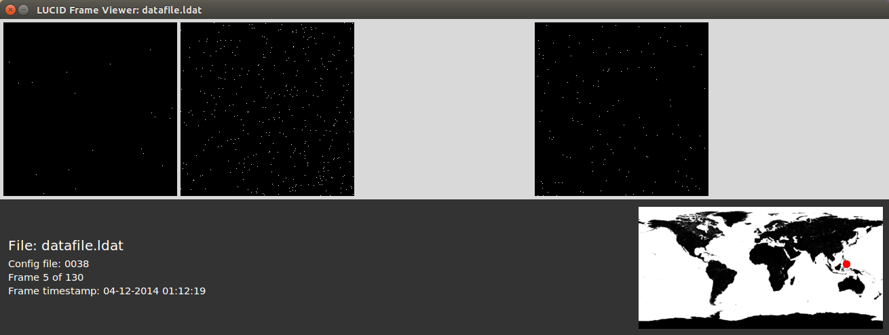

# LUCID Frame Viewer

A frame viewer for raw data files from the LUCID experiment.



## Installation and Usage

To use the viewer, simply clone the repository, install the required libraries listed below and run the frameview program with the name of a data file as the first argument:

```
git clone https://github.com/calhewitt/lucid-frame-viewer
cd lucid-frame-viewer
./frameview datafile.ldat
```

### Noise Masking

To enable noise masking, run the program with the --noisemask argument, eg.

```
./frameview datafile.ldat --noisemask
```

The noise mask is computed, for the best balance between accuracy and performance, from the first 10 frames of the data file. 

## Requirements

* Python 2.7
* NumPy
* PyEphem (for computing the satellite's position)
* PIL (for plotting frames)
* Tkinter

## Getting new Telemetry Data

The frame viewer uses telemetry data from the SpaceTrack API to compute positions, and after time this will become inaccurate. To update the data, run the get_tle script from the terminal.